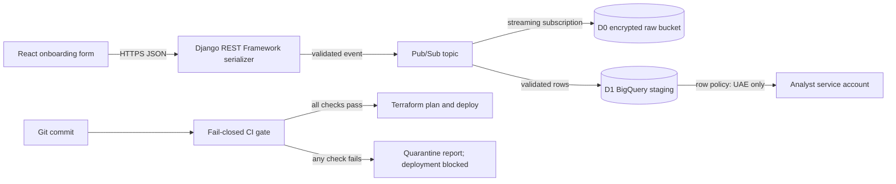

# Secure Student Onboarding Deployment Blueprint

**Candidate:** Rudrakshi Pasarkar  
**Contact:** rudrakshipasarkar@gmail.com  
**Role:** Junior Cloud & DevOps Engineer (Google Cloud Platform / Django / React)

This repository restores integrity to a compromised staging workflow. It provisions a protected raw landing zone and enforced analytics layer in Google Cloud, blocks unsafe commits before deployment, and validates student-onboarding data with deterministic Yes/No rules.

## Submission map

| Requirement | Evidence |
|---|---|
| Secure Infrastructure as Code | `infrastructure/main.tf`, `infrastructure/iam.tf`, `infrastructure/row_access.tf` |
| Fail-closed build gate | `.github/workflows/fail-closed-gate.yml`, `scripts/run_security_gate.py` |
| Django REST Framework validation | `application/onboarding/serializers.py`, `application/onboarding/dcyn.py` |
| Pub/Sub and BigQuery mapping | `schemas/student_onboarding.schema.json`, `schemas/bigquery_student_onboarding.json`, `docs/DATA_FLOW.md` |
| Automated evidence | `tests/`, `evidence/FAIL_CLOSED_DEMO.md` |
| Presentation | `submission/Rudrakshi_Pasarkar_HabotConnect_Project.pptx` |

## Architecture



## Local verification

```bash
python -m unittest discover -s tests -v
python scripts/run_security_gate.py --scan-root . --report build/gate-report.json
terraform -chdir=infrastructure fmt -check -recursive
terraform -chdir=infrastructure init -backend=false
terraform -chdir=infrastructure validate
```

The Python test suite requires no cloud credentials. Terraform validation downloads the Google provider but creates no resources. A real deployment requires an authorized Google Cloud project, billing, enabled APIs, and Application Default Credentials.

## Prepare submission artifacts

Run the submission preparation script before uploading. It permanently applies
Rudrakshi ownership to PowerPoint metadata and hidden themes, then rebuilds the
source ZIP without caches or local build files.

```bash
python scripts/prepare_submission.py --pptx submission/Rudrakshi_Pasarkar_HabotConnect_Project.pptx --source-root .
```

## Safe deployment

1. Copy `infrastructure/terraform.tfvars.example` to an ignored `terraform.tfvars` file.
2. Supply real project and principal values. Never commit credentials.
3. Authenticate with Workload Identity Federation in automation or Application Default Credentials locally.
4. Run `terraform plan -out=tfplan` and review it.
5. Apply only after approval: `terraform apply tfplan`.

## Fail-closed behavior

The deployment job depends on the gate job. Any formatting, syntax, test, Infrastructure as Code, dependency, or secret-scan failure prevents deployment. The gate writes only a finding category and a redacted location to `build/gate-report.json`; it never copies the suspect file or secret value.

## Assumptions

The hiring brief does not provide the student JSON or field limits. `docs/ASSUMPTIONS.md` records the explicit choices made here. All validation rules are encoded in one DCYN library and mirrored in the JSON and BigQuery schemas.
